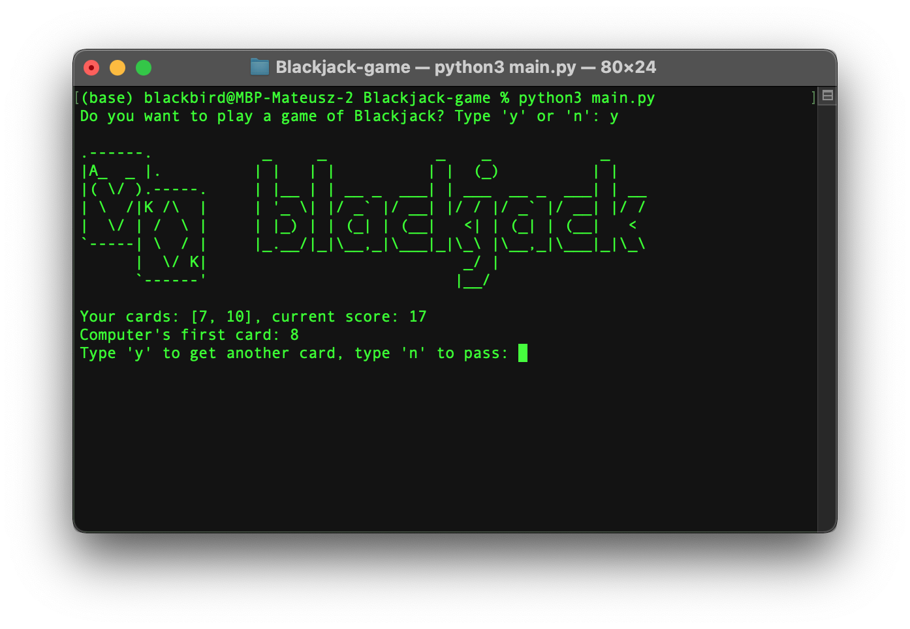

# **Blackjack game**

### Card game based on the one which is commonly played in casinos

---

### Objectives:

The main objective for both players is to keep drawing cards until their total sum in hand equals 21.

#### Player has possibility to stop drawing cards and then win conditions are checked:

- Player that is closer to sum of 21 wins the game;
- Game is ended by draw, when the sum of cards from both players is identical;

_or_

#### Continue drawing and the game is ended when:

- The "blackjack" is reached. The player that reach exactly '21' score wins the game;
- First of the players that exceed sum of 21 lose the game immediately;

## Screenshot:

